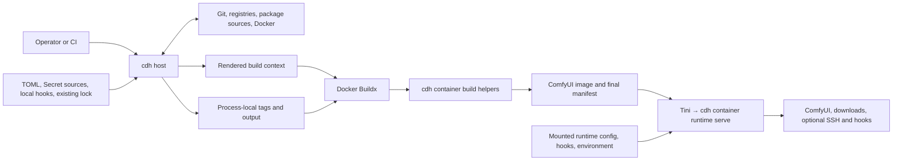

# Architecture

This document gives maintainers a current system map: where responsibilities live, which direction dependencies and data flow, and how the main execution paths cross host, Docker build, and container runtime boundaries. See [Cross-module contracts](contracts.md) for the strict authority, ownership, trust, replay, evidence, and lifecycle invariants behind these boundaries.

## System context

The same `comfyui-docker-helper` distribution provides operator-facing host commands and image-internal container helpers. Host commands turn declarative configuration and selected local inputs into a Docker build context. Docker Buildx executes that context, and the installed cdh wheel supplies both build helpers and the runtime entrypoint inside the resulting image.



The host build boundary and the runtime boundary admit different inputs. Runtime configuration and mounted hooks can change deployment behavior, but they do not re-enter host planning or rewrite the image's final build observation.

## Platform execution boundary

The root CLI, configuration, shared services, rendering, and every `cdh host *` workflow support native Windows and Linux hosts on each Python minor declared by the project (`3.12`, `3.13`, and `3.14`). A Windows host normally drives Docker Desktop in Linux container mode. Other Docker endpoints remain Docker-owned compatibility surfaces and must provide equivalent Linux `amd64` Buildx behavior; automated Windows qualification does not exercise them. Host support does not imply support for Windows container images.

`cdh container *` is an image-internal Linux execution surface. On a non-Linux host the package and root CLI remain importable, container help remains available, and attempting to execute a container helper returns the platform-boundary diagnostic without importing its Linux-only implementation closure.

Host source admission observes user-selected local inputs under a cooperative-input contract rather than treating them as an adversarial filesystem namespace. It rejects unsafe path shapes and statically observed links, reparse points, and special files, then obtains type, byte bounds, bytes, and content identity from one opened leaf. It does not isolate those inputs from an untrusted local process modifying them concurrently. This boundary is separate from cdh-owned private state and from the container download, placement, runtime-state, and executable-containment rules in [Cross-module contracts](contracts.md#host-local-filesystem-boundaries).

## Component responsibilities

| Component | Responsibility |
| --- | --- |
| [`config/`](../../src/comfyui_docker_helper/config/) | Strict public and runtime models, merge and validation, canonical request/lock/reconciliation models, BuildPlan construction, and final-manifest schemas. It owns shared decisions and serialized shapes, not concrete external I/O orchestration. |
| [`host/`](../../src/comfyui_docker_helper/host/) | Operator CLI composition, provider acquisition, command-scoped Secret resolution and credential delivery, Docker-backed uv resolution, canonical-wheel construction, lock/context orchestration, publication choices, diagnostics, and Buildx invocation. It owns host filesystem, network, Git, Docker, and package-build effects. |
| [`rendering/`](../../src/comfyui_docker_helper/rendering/) | Deterministic projection of one BuildPlan plus verified release/local inputs into a directly Buildx-usable context and Dockerfile. Rendering does not plan or resolve identities. |
| [`container/`](../../src/comfyui_docker_helper/container/) | Image-internal BuildPlan admission, build-time installation/download/final observation, and runtime configuration, transfer, hook, SSH, process, and lifecycle services. |

Package-level modules provide shared bounded helpers such as ComfyUI requirements parsing, PyTorch resolution rules, release artifacts, and exact project-owned identities. They support the four main components without creating another orchestration layer.

The operator-facing `cdh host validate`, `render`, and `build` commands use a host-owned presentation boundary. Root help, usage, and parameter errors remain owned by Typer; image-internal `cdh container` commands retain simple plain execution and logging protocols. An explicitly exposed operator-facing live stream, currently BuildKit's unified stdout, remains outside host presentation, while captured provider and protocol output stays owned by its adapter. See the [CLI presentation rules](contributing.md#cli-presentation) for coding and testing guidance.

## Dependency direction

Host orchestration is the outer build-time composition root. It calls shared configuration and planning code, supplies concrete acquisition providers, and hands an accepted BuildPlan to rendering. Rendering depends on config-owned types and release inputs; it does not call provider orchestration or container services.

The Docker build is a process boundary rather than an in-process dependency. The rendered Dockerfile invokes the installed `cdh container` commands inside the build. Container helpers depend on config-owned models and their own container-local services; they do not call host planning or rendering.

Data flows forward:

```text
effective config
  -> in-memory canonical request graph
  -> accepted canonical lock
  -> BuildPlan
  -> rendered context
  -> image mutations
  -> final observation
```

Neither rendering nor container helpers reconstruct intent from host configuration. The final observation does not feed back into reconciliation or planning.

## Planning and artifact placement

The following table locates the main planning and evidence concepts. The [cross-module contracts](contracts.md) define their exact authority and non-authority boundaries.

| Concept | Location and role |
| --- | --- |
| [Canonical request graph](../../src/comfyui_docker_helper/config/canonical_request.py) | An immutable in-memory projection assembled during host planning. Reconciliation consumes its desired requests, and BuildPlan construction consumes the same graph with the accepted lock. |
| [Canonical lock](../../src/comfyui_docker_helper/config/canonical_lock.py) | Strict serialized host reconciliation state containing accepted exact external and local-content identities. It is written beside the context but excluded from Docker build input. |
| [BuildPlan](../../src/comfyui_docker_helper/config/build_plan.py) | The immutable build execution plan constructed from the request graph and accepted lock, then serialized into the Docker context and mounted read-only for authenticated, command-specific container consumption. cdh does not retain it in the final image filesystem. |
| [Buildx output plan](../../src/comfyui_docker_helper/host/buildx.py) | Process-local resolved publication tags and output selection for one Buildx invocation. It is not part of the BuildPlan, rendered context, final manifest, or image identity. |
| [Materialization](../../src/comfyui_docker_helper/rendering/final_materializer.py) | A host-side projection boundary that verifies supplied wheel and local bytes, writes the BuildPlan-derived context, and performs no planning or resolution. Host orchestration publishes or compares the complete cdh-owned context. |
| [Final manifest](../../src/comfyui_docker_helper/container/final_manifest.py) | Final image-state observation emitted only after build mutations and checks succeed. It records observed state but does not become a resolver, lock, or planning input. |

The canonical cdh wheel crosses the host-to-build boundary as one verified release artifact. Host planning constructs it from package-owned release projection inputs, materialization binds its exact bytes to the BuildPlan, and the image installs cdh from that wheel. The uv image used for resolution and the isolated wheel build backend remain separate responsibilities even when their version strings happen to match.

## Execution scenarios

### Validate configuration

`cdh host validate` loads the requested TOML layers, merges them in command-line order, and applies strict structural, domain, and cross-field validation to the effective configuration. It validates Secret source locators and credential references structurally but does not read a Secret source. This path does not construct providers, call Docker, reconcile a lock, create a BuildPlan, or write files.

### Render and reconcile a context

The host render service admits local hook roots and any existing canonical lock, then obtains the prerequisite exact identities needed to assemble the canonical request graph. It reconciles the graph according to the selected policy, constructs one BuildPlan from the accepted lock, and passes the plan with the canonical wheel and exact local sources to materialization.

Canonical Git credential route metadata enters the request graph, image-configuration digest, and BuildPlan, while Secret source locators and resolved values remain host-only. A command-scoped host session supplies credentials when direct-Git work needs them; on `host build`, the accepted BuildPlan determines which session snapshots are bound to the real Buildx invocation. See the [Secret source and Git credential contract](contracts.md#secret-source-and-git-credential-boundary) for exact matching, transport, persistence, and cleanup boundaries.

Materialization re-verifies supplied local and release bytes and projects the complete context in a host-owned private stage. POSIX hosts retain deterministic context permission checks; Windows hosts compare filesystem shape and bytes, while the rendered Dockerfile applies the required Linux image modes to the plan, runtime configuration, and hooks. The host service owns stage cleanup and context publication. Overwrite is portable but not crash-durable, while a no-write check compares the complete expected tree. See the [materialization contract](contracts.md#materialization-boundary) for the exact ownership and failure boundaries and [Build and lock images](../user/build-and-lock.md) for the operator workflow and reconciliation modes.

### Build and observe the final image

`cdh host build` prepares the context through the same path and then invokes Docker Buildx. It resolves publication templates from the accepted ComfyUI identity into a process-local Buildx output plan, keeping image construction authority separate from registry naming and output selection. The rendered Dockerfile carries the expected BuildPlan digest literally. Each image-internal build helper receives the context Plan through a read-only bind for only its instruction, admits it against that digest, and receives only its command-specific typed projection.

For a direct-Git plan with HTTP(S) credential routes, the host derives the complete grant set from the accepted BuildPlan and delivers it through required BuildKit Secret mounts. The image-side helper consumes only the admitted route projection, while root Git operations, recursive submodules, and trusted installers share the existing combined custom-node instruction. Git remains authoritative for URL rewrites and redirects; the cross-module contract defines the precise route and mount invariants.

When `host build --ssh` is applicable to a direct-Git custom node, POSIX hosts require a non-empty `SSH_AUTH_SOCK`; native Windows instead delegates `default` agent selection to Docker and BuildKit because there is no POSIX socket-environment contract to validate. After context preparation, the host maps the default agent and existing known-hosts files directly into the Buildx invocation. POSIX discovers the defined user and system paths, while Windows discovers only user-profile paths. These compatibility inputs bypass configuration, reconciliation, BuildPlan, and materialization; rendering remains a function of BuildPlan and declares only stable optional mount identities for a direct-Git plan.

After context preparation, the host forwards any selected external-cache import or export specification directly to Buildx. Cache selection belongs to host Docker execution rather than the BuildPlan or rendered context; see the [Docker transport contract](contracts.md#uv-release-backend-docker-transport-and-cdh-wheel) for the complete ownership boundary.

The Dockerfile installs the toolchain and application, processes configured nodes and files, and invokes final observation after all build mutations. Final observation rechecks current image state and publishes the manifest; it does not make another planning decision. The complete Plan remains available in the rendered host context for audit and rebuild, while cdh retains only its digest binding in the final manifest rather than retaining the Plan at its fixed product path.

### Run the container lifecycle

Tini runs as image PID 1 and starts `cdh container runtime serve`. That same cdh process remains Tini's direct child and the only runtime controller until the container exits. [`runtime_serve.py`](../../src/comfyui_docker_helper/container/runtime_serve.py) is the composition root: [`runtime_controller.py`](../../src/comfyui_docker_helper/container/runtime_controller.py) arbitrates cross-generation state and restart requests, while [`runtime_lifecycle.py`](../../src/comfyui_docker_helper/container/runtime_lifecycle.py) owns the download, SSH, ComfyUI, readiness, hook, signal, and exact cleanup policy for one generation.

Each initial or restarted generation freshly loads baked and mounted runtime configuration, discovers both hook sources, and constructs new download and SSH owners. Replacement is serial: the old generation's exact cdh-owned work must become quiescent and be reaped before the successor is admitted. The main lifecycle thread remains the only authority that accepts a restart or signal-driven shutdown and applies process policy; control-connection workers only submit requests and deliver controller-owned results. Natural ComfyUI exit or a failed replacement still ends cdh and the container, leaving Docker's restart policy as the automatic recovery authority.

```text
restart/status/follow client -> private runtime control -> cdh controller
deployment inputs            -> generation admission   -> one-generation lifecycle
runtime stdout/stderr         -> controller log broker  -> original container output
                                                     +-> bounded live followers
```

The private control endpoint provides container-local restart and observation without transferring lifecycle ownership to the client. The controller-lifetime output broker preserves the original container stdout and stderr as primary logging authorities while fan-out supplies live-only followers across generation replacement.

This runtime path consumes the generated runtime projection and deployment-time overrides rather than host configuration, the canonical lock, or reconciliation providers. See [Runtime and lifecycle](../user/runtime.md) for operational order and shutdown behavior, and [Cross-module contracts](contracts.md) for process-ownership and trust boundaries.
