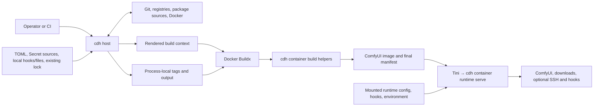

# Architecture

This document gives maintainers a current system map: where responsibilities live, which direction dependencies and data flow, and how the main execution paths cross host, Docker build, and container runtime boundaries. See [Cross-module contracts](contracts.md) for the strict authority, ownership, trust, replay, evidence, and lifecycle invariants behind these boundaries.

## System context

The same `comfyui-docker-helper` distribution provides operator-facing host commands and image-internal container helpers. Host commands turn declarative configuration and selected local inputs into a Docker build context. Docker Buildx executes that context, and the installed cdh wheel supplies both build helpers and the runtime entrypoint inside the resulting image.



The host build boundary and the runtime boundary admit different inputs. Runtime configuration and mounted hooks can change deployment behavior, but they do not re-enter host planning or rewrite the image's final build observation.

## Platform execution boundary

The root CLI, configuration, shared services, rendering, and every `cdh host *` workflow support native Windows and Linux hosts on each Python minor declared by the project (`3.12`, `3.13`, and `3.14`). A Windows host normally drives Docker Desktop in Linux container mode. Other Docker endpoints remain Docker-owned compatibility surfaces and must provide equivalent Linux `amd64` Buildx behavior; automated Windows qualification does not exercise them. Host support does not imply support for Windows container images.

`cdh container *` is an image-internal Linux execution surface. On a non-Linux host the package and root CLI remain importable, container help remains available, and attempting to execute a container helper returns the platform-boundary diagnostic without importing its Linux-only implementation closure.

Host source admission for public `type = "local"` `[[files]]` declarations handles one user-selected regular file or complete directory tree under a cooperative-input contract. It rejects unsafe shapes and observed links, reparse points, and special files; accepted file/tree facts flow through the public-local admission bundle and BuildPlan, while host locators remain out of serialized artifacts. Hook roots and local executable inputs use separate admission/acquisition paths. The boundary is separate from cdh-owned private state and from the container download, placement, runtime-state, and executable-containment rules in [Cross-module contracts](contracts.md#host-local-filesystem-boundaries).

## Component responsibilities

| Component | Responsibility |
| --- | --- |
| [`cli_output/`](../../src/comfyui_docker_helper/cli_output/) | Presentation-neutral root detail settings, independent stream capability policy, control-safe text, and the minimal injected event-sink protocol. It contains no Host or Container renderer. |
| [`config/`](../../src/comfyui_docker_helper/config/) | Strict public and runtime models, merge and validation, and canonical request/lock/reconciliation models. `config/planning/` owns local-tree digests, serialized planning projections, and BuildPlan construction; `config/evidence/` owns final-manifest schemas. The component owns shared decisions and serialized shapes, not concrete external I/O orchestration. |
| [`filesystem/`](../../src/comfyui_docker_helper/filesystem/) | Cooperative cross-platform regular-file and complete local-tree admission, member inventory records, bounded reads and streaming, platform-available clone support, and Windows filesystem primitives. It is a shared low-level boundary with no Host, rendering, or Container orchestration. |
| [`host/`](../../src/comfyui_docker_helper/host/) | Operator CLI composition, provider acquisition, command-scoped Secret resolution and credential delivery, Docker-backed uv resolution, canonical-wheel construction, lock/context orchestration, publication choices, diagnostics, and Buildx invocation. It owns host filesystem, network, Git, Docker, and package-build effects. |
| [`rendering/`](../../src/comfyui_docker_helper/rendering/) | Deterministic projection of one BuildPlan plus verified release/local inputs into a directly Buildx-usable context and Dockerfile. Rendering does not plan or resolve identities. |
| [`container/`](../../src/comfyui_docker_helper/container/) | Image-internal BuildPlan admission, build-time installation/download/local-tree normalization/final observation, and runtime configuration, transfer, hook, SSH, process, and lifecycle services. |

Package-level modules provide package-wide authorities such as release artifacts, SSH build inputs, and exact project-owned identities. Planning-specific requirement and PyTorch rules live under `config/planning/`; these modules support the core planning and execution components without creating another orchestration layer.

The root CLI constructs one immutable output setting and independently detects the capabilities of the actual stdout and stderr destinations. Workflow, progress, and lifecycle producers that cross an event boundary emit typed semantic facts to Host- or Container-owned event presenters rather than importing Rich or formatting terminal strings. Explicit results and direct diagnostics retain their existing presenters, while root help, usage, and parameter errors remain Typer-owned. The Host event presenter may use terminal-aware Live output for one-shot preparation; Container helper presentation is durable plain text except for directly interactive download progress; Runtime presentation is always plain. BuildKit's library-yielded line stream and inherited child streams remain outside event presentation, while captured provider and protocol output stays adapter-owned. See the [CLI presentation rules](contributing.md#cli-presentation) for coding and testing guidance.

## Dependency direction

Host orchestration is the outer build-time composition root. It calls shared configuration and planning code, supplies concrete acquisition providers, and hands an accepted BuildPlan to rendering. Rendering depends on config-owned types and release inputs; it does not call provider orchestration or container services.

The shared `filesystem/` foundation can be consumed by Host, rendering, and Container owners but does not depend back on them. Within `config/`, validation, credential, and root model/merge primitives form the inward foundation; authored and runtime configuration are independent consumers of that foundation, planning consumes authored configuration, and evidence consumes planning results. Executable architecture tests own the exact forbidden dependency directions rather than duplicating a complete rule table here.

The Docker build is a process boundary rather than an in-process dependency. The rendered Dockerfile invokes the installed `cdh container` commands inside the build. Container helpers depend on config-owned models and their own container-local services; they do not call host planning or rendering.

Data flows forward:

```text
effective config
  -> in-memory canonical request graph
  -> one Host public-local-file/tree admission bundle
  -> accepted canonical lock
  -> BuildPlan (complete tree inventory; locked local-file SHA/tree aggregate identities)
  -> private materialization/rendered context
  -> image mutations and local-tree normalization
  -> final observation
```

Neither rendering nor container helpers reconstruct intent from host configuration. The final observation does not feed back into reconciliation or planning.

## Planning and artifact placement

The following table locates the main planning and evidence concepts. The [cross-module contracts](contracts.md) define their exact authority and non-authority boundaries.

| Concept | Location and role |
| --- | --- |
| [Canonical request graph](../../src/comfyui_docker_helper/config/planning/request.py) | An immutable in-memory projection assembled during host planning. Local source requests remain shape-neutral; the graph carries no host locator or tree inventory. Reconciliation and BuildPlan construction consume this graph with one matching public-local admission bundle. See [planning contracts](contracts.md#canonical-request-graph). |
| Host public-local-file/tree admission bundle ([adapter](../../src/comfyui_docker_helper/host/context/local_inputs.py)) | One process-local bundle per preparation attempt containing admitted public local-file/tree facts, private materialization sources, and empty-source warnings. It is the shared authority for those declarations in reconciliation, BuildPlan construction, and materialization; hooks and local executables use separate authorities. See [the bundle contract](contracts.md#host-local-admission-bundle). |
| [Canonical lock](../../src/comfyui_docker_helper/config/planning/canonical_lock.py) | Strict serialized host reconciliation state containing exact external identities, target-keyed local-file SHA rows, and aggregate-only local-tree rows when content-locked. It is written beside the context but excluded from Docker build input. See [canonical lock](contracts.md#canonical-lock). |
| [BuildPlan](../../src/comfyui_docker_helper/config/planning/build_plan.py) | Immutable build execution authority constructed from the graph, accepted lock, and admitted inputs. It is the only complete serialized/planning inventory authority for local trees; process-local bundles and typed execution projections carry only the member fields their owners require. It is mounted read-only for command-specific container consumption. See [BuildPlan](contracts.md#buildplan). |
| [Buildx output plan](../../src/comfyui_docker_helper/host/buildx.py) | Process-local resolved publication tags and output selection for one Buildx invocation. It is not part of the BuildPlan, rendered context, final manifest, or image identity. |
| [Materialization](../../src/comfyui_docker_helper/rendering/final_materializer.py) | Host-side private-stage projection of one BuildPlan plus exact release/local inputs; it performs no planning or resolution and publishes or compares a complete cdh-owned context. See [materialization](contracts.md#materialization-boundary). |
| [Final manifest](../../src/comfyui_docker_helper/container/build/manifest/observer.py) | Final image-state observation after build mutations, with one compact Plan-bound row per local tree. It remains downstream evidence, not a resolver, lock, or planning input. See [final observation](contracts.md#image-local-tree-projection-and-final-evidence). |

The canonical cdh wheel crosses the host-to-build boundary as one verified release artifact. Host planning constructs it from package-owned release projection inputs, materialization binds its exact bytes to the BuildPlan, and the image installs cdh from that wheel. Materialization also obtains the static workspace profile from this exact retained wheel, so the installed package tree does not become a second release input. The uv image used for resolution and the isolated wheel build backend remain separate responsibilities even when their version strings happen to match.

## Execution scenarios

### Validate configuration

`cdh host validate` loads the requested TOML layers, merges them in command-line order, and applies strict structural, domain, and cross-field validation to the effective configuration. It validates Secret source locators and credential references structurally but does not read a Secret source. This path does not construct providers, call Docker, reconcile a lock, create a BuildPlan, or write files.

### Render and reconcile a context

The host render service obtains the prerequisite exact identities and assembles the canonical request graph. After graph construction, it admits effective public local file/tree declarations into one bundle; hook roots and local executable inputs use separate adapters and acquirers. The public-local bundle is the shared source of accepted file/tree facts for lock reconciliation, BuildPlan construction, and private materialization; no host locator is serialized. The service constructs one BuildPlan from the graph, accepted lock, and matching local inputs, then passes the plan with the canonical wheel and exact local sources to materialization. See [Host local-admission bundle](contracts.md#host-local-admission-bundle).

Canonical Git and downloader credential route metadata enters the request graph, image-configuration digest, and BuildPlan, while host Secret source locators and resolved values remain process-local. A command-scoped host session acquires each logical source once and applies consumer-specific Git-password or Bearer-token admission. On `host build`, the accepted BuildPlan determines the consumer-isolated snapshots bound to the real Buildx invocation. See the [host Secret source and credential contract](contracts.md#host-secret-source-and-credential-boundary) for exact matching, transport, persistence, and cleanup boundaries.

Materialization re-verifies supplied local and release inputs and projects the complete context in a host-owned private stage. Local build-file bytes occupy independent Plan-owned context slots, while the rendered Dockerfile applies the required Linux image modes. The host service owns stage cleanup, context comparison, and publication. See the [materialization contract](contracts.md#materialization-boundary) for the exact filesystem, platform, and failure rules and [Build and lock images](../user/build-and-lock.md) for the operator workflow and reconciliation modes.

### Build and observe the final image

`cdh host build` prepares the context through the same path and then invokes Docker Buildx. It resolves publication templates from the accepted ComfyUI identity into a process-local Buildx output plan, keeping image construction authority separate from registry naming and output selection. The rendered Dockerfile carries the expected BuildPlan digest literally. Each image-internal build helper receives the context Plan through a read-only bind for only its instruction, admits it against that digest, and receives only its command-specific typed projection.

For a direct-Git plan with HTTP(S) credential routes, the host derives the complete grant set from the accepted BuildPlan and delivers it through required BuildKit Secret mounts. The image-side helper consumes only the admitted route projection, while root Git operations, recursive submodules, and trusted installers share the existing combined custom-node instruction. Git remains authoritative for URL rewrites and redirects; the cross-module contract defines the precise route and mount invariants.

For a build with an effective HTTPX file, the host similarly binds every distinct Secret referenced by the effective downloader routes, but only to the file-download instruction. The HTTPX adapter applies the credential policy to each outbound request, including redirects. Downloader credential routes and Secret definitions are build-only and do not enter the generated runtime projection; the [credential contract](contracts.md#host-secret-source-and-credential-boundary) owns the exact selection and persistence rules.

When `host build --ssh` is applicable to a direct-Git custom node, POSIX hosts require a non-empty `SSH_AUTH_SOCK`; native Windows instead delegates `default` agent selection to Docker and BuildKit because there is no POSIX socket-environment contract to validate. After context preparation, the host maps the default agent and existing known-hosts files directly into the Buildx invocation. POSIX discovers the defined user and system paths, while Windows discovers only user-profile paths. These compatibility inputs bypass configuration, reconciliation, BuildPlan, and materialization; rendering remains a function of BuildPlan and declares only stable optional mount identities for a direct-Git plan.

After context preparation, the host forwards any selected external-cache import or export specification directly to Buildx. Cache selection belongs to host Docker execution rather than the BuildPlan or rendered context; see the [Docker transport contract](contracts.md#uv-release-backend-docker-transport-and-cdh-wheel) for the complete ownership boundary.

The Dockerfile installs the toolchain and application, processes configured nodes, and then applies authoritative HTTP or local build-file content before final observation. Each local tree is copied once to its exact target root; the Plan-mounted `normalize-local-trees` helper applies the selected image modes while remaining limited to expected roots and members. Final observation publishes compact Plan-bound evidence after all mutations and does not make another planning decision. Only HTTP file declarations project into baked runtime defaults. See the [image projection and final-evidence contract](contracts.md#image-local-tree-projection-and-final-evidence) and [final-observation contract](contracts.md#final-observation-and-replay-ceiling).

### Run the container lifecycle

Tini runs as image PID 1 and starts `cdh container runtime serve`. That same cdh process remains Tini's direct child and the only runtime controller until the container exits. [`runtime/serve.py`](../../src/comfyui_docker_helper/container/runtime/serve.py) is the composition root: [`runtime/controller.py`](../../src/comfyui_docker_helper/container/runtime/controller.py) arbitrates cross-generation state and restart requests, while [`runtime/lifecycle.py`](../../src/comfyui_docker_helper/container/runtime/lifecycle.py) owns the download, SSH, ComfyUI, readiness, hook, signal, and exact cleanup policy for one generation.

At `runtime serve` startup, [`runtime/serve.py`](../../src/comfyui_docker_helper/container/runtime/serve.py) captures one immutable environment snapshot. Its text view feeds runtime configuration and hooks, while its byte view feeds [`runtime/ssh/config.py`](../../src/comfyui_docker_helper/container/runtime/ssh/config.py) through the generation's SSH owner; the latter publishes the cdh-owned sshd configuration for native SSH sessions. The renderer and materializer provide a POSIX-shell SSH-conditional profile artifact consumed when an SSH-associated login shell loads the image's system profile. An ordinary remote command remains on the native path and starts in `/root`; an explicitly requested login shell enters `WORKSPACE` when it loads that profile.

Each initial or restarted generation freshly loads baked and mounted runtime configuration, discovers both hook sources, and constructs new download and SSH owners from that same snapshot. Mounted runtime configuration may independently declare downloader routes and container-visible env/file Secret sources; each generation owns a fresh in-memory credential session. Replacement is serial: the old generation's exact cdh-owned work must become quiescent and be reaped before the successor is admitted. The main lifecycle thread remains the only authority that accepts a restart or signal-driven shutdown and applies process policy; control-connection workers only submit requests and deliver controller-owned results. Natural ComfyUI exit or a failed replacement still ends cdh and the container, leaving Docker's restart policy as the automatic recovery authority. The [runtime configuration contract](contracts.md#runtime-configuration-stays-separate-from-build-planning) owns the exact Secret acquisition and lifetime rules; the [SSH contract](contracts.md#ssh-environment-configuration-and-lifecycle-boundary) owns the projection and profile boundaries.

```text
restart/status/follow client -> private runtime control -> cdh controller
deployment inputs            -> generation admission   -> one-generation lifecycle
runtime stdout/stderr         -> controller log broker  -> original container output
                                                     +-> bounded live followers
```

The private control endpoint provides container-local restart and observation without transferring lifecycle ownership to the client. The controller-lifetime output broker preserves the original container stdout and stderr as primary logging authorities while fan-out supplies live-only followers across generation replacement. Runtime presentation is constructed inside that broker lifetime: main-thread lifecycle facts render directly, while genuine background producers use one controller-scoped delivery owner. The [stream ownership contract](contracts.md#original-container-output-remains-primary) defines its pressure, ordering, and teardown invariants.

This runtime path consumes the generated remote-file runtime projection and deployment-time overrides rather than host configuration, local build-file inputs, the canonical lock, or reconciliation providers. See [Runtime and lifecycle](../user/runtime.md) for operational order and shutdown behavior, and [Cross-module contracts](contracts.md) for process-ownership and trust boundaries.
